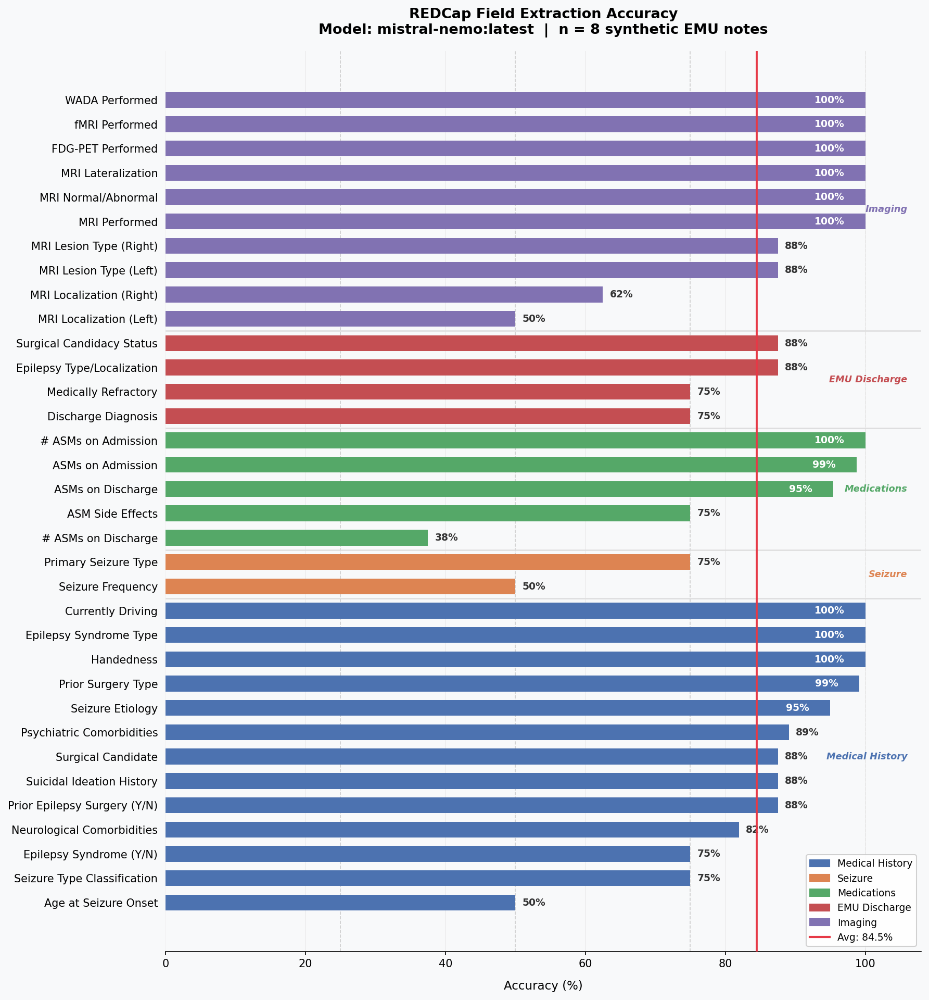

**To:** Dr. Belfin **From:** Stephen Chen, Undergraduate Research Assistant **Date:** April 4, 2026 **Re:** Clinical Notes Pipeline — Progress Update

**GitHub:** [stephenchen06/clinical-notes-pipeline](https://github.com/stephenchen06/clinical-notes-pipeline)

------------------------------------------------------------------------

## Evaluation Methodology

To measure accuracy without exposing real patient data, I utilized ChatGPT to generate 8 synthetic EMU discharge notes, each designed to represent a clinically distinct scenario (based on Dr. Waters' data dictionary) (full note text in the appendix). The scenarios are: MTLE with hippocampal sclerosis, FND/PNEE, drug-resistant right frontal epilepsy with prior VNS, JME, post-stroke focal epilepsy, mixed FND + focal epilepsy, LGI1 autoimmune limbic encephalitis, and Dravet syndrome.

Each note also had a generated *expected correct value* for every REDCap field the pipeline targets — over 30 fields per note. The ground truth is stored as a CSV and the evaluation is automated: after the pipeline processes each note, an evaluation script compares its output field-by-field to the ground truth and computes per-field and overall accuracy. Results are visualized as a grouped bar chart.

The pipeline runs a **single-pass structured extraction** directly from the cleaned note text via a locally-hosted Ollama instance (no data leaves the machine). The 30+ fields are split into 5 focused prompt groups — `medical_history`, `seizure`, `asms`, `discharge`, and `imaging` — each sent as a separate Ollama call. Splitting into groups keeps individual prompts short and reduces instruction-following failures that occur when a 12B model is given too many fields at once. The model outputs JSON; a post-processing normalization layer maps free-text labels to valid REDCap codes, handles boolean strings, and applies clinically justified defaults.

------------------------------------------------------------------------

## Accuracy Progression

| Iteration | What Changed | Avg Accuracy |
|------------------------|------------------------|------------------------|
| llama3.2:3b (baseline) | Initial model | \~23.5%\* |
| mistral-nemo:12b | Model upgrade | 72.0% |
| Round 1 fixes | Post-processing defaults + prompt disambiguation | 79.2% |
| Round 2 fixes | Epilepsy syndrome default + myoclonus instruction | 82.5% |

\*Single-select fields only; checkbox 0s were excluded from the baseline to avoid inflating the number.

**Baseline — llama3.2:3b (\~23.5%).** The 3B model couldn't reliably follow structured multi-field extraction prompts. Output was inconsistent — sometimes valid JSON, sometimes free text, sometimes partial completions.

**Model upgrade — mistral-nemo:12b (72.0%).** Swapping to mistral-nemo with no other changes gave a +48.5 percentage point gain. This confirmed that model capacity was the primary bottleneck, not prompt design. The 12B model follows structured JSON output reliably enough to be worth iterating on.

**Round 1 fixes (79.2%).** Two categories of changes:

1.  **Post-processing defaults.** For fields where absence of mention reliably means "No" — FDG-PET, fMRI, WADA, and ASM side effects — null model outputs are now defaulted to the "No" code rather than left blank. This captures the common case where the model simply omits a field because it isn't discussed in the note, rather than hallucinating a positive finding. These defaults are applied in the `normalize_fields()` post-processing pass, after the model has already returned its output.

2.  **Prompt disambiguation.** Three targeted clarifications were added to the prompt instructions:

    -   Explicit instruction that seizure etiology (e.g., "post-stroke epilepsy") does not imply that stroke is a current neurological comorbidity — a conflation the model made reliably.
    -   Per-code examples for the seizure etiology field to reduce confusion between focal structural, generalized, unknown, and PNEE classifications.
    -   Frequency anchors mapping exact phrases to numeric codes (e.g., "2–3 times per month" → code 5), since the model understood frequency qualitatively but mapped to wrong bins.

**Round 2 fixes (82.5%).** Two more targeted changes:

1.  **Epilepsy syndrome default.** Added `medhx_szsyndrome` to the `FIELD_DEFAULTS` dict: when the model returns null, default to "No confirmed syndrome." This is the correct answer in the majority of cases. The model tended to leave this field blank when the note didn't mention a named syndrome, when the right answer was "No."

2.  **Myoclonus instruction.** Added explicit instruction to the `seizure` prompt group that myoclonic jerks in JME and Dravet syndrome should be coded as Myoclonus (code 9), not Primary GTC (code 1) — a consistent model error on those two notes.

### Field-Level Accuracy



*mistral-nemo:12B, n=8 synthetic EMU notes. Average: 82.5%.*

------------------------------------------------------------------------

## Current Limitations

**Discharge ASM count (38%).** The model reliably counts medications listed at admission but loses track when counting the discharge list. The discharge medication section appears at different locations across notes and is sometimes a modified version of the admission list, which the model conflates.

**Age at seizure onset (50%).** The model frequently returns the patient's current age rather than onset age, or misses onset entirely when it's stated indirectly (e.g., "epilepsy since childhood" rather than an explicit age). This is a named-entity extraction problem more than a reasoning problem.

**Seizure frequency (50%).** The model understands frequency qualitatively but fails to map imprecise or narrative descriptions to the correct coded bin. Phrases like "occasional" or "a few times a month" sit ambiguously between bins, and the model's choice is not consistent.

**MRI lateralization (50%).** Sensitive to phrasing variation in radiology reports — "left-predominant," "predominantly left," "left temporal," and "left greater than right" should all map to the same code, but the model's behavior varies by phrasing.

**Systemic issues:**

-   **Non-determinism.** Inference is non-deterministic by default in Ollama, so the same note can produce slightly different results run-to-run. Setting `temperature=0` would make results reproducible and make it much easier to confirm whether a given prompt change is actually robust.

-   **Small evaluation set.** Every prompt improvement is validated against only 8 synthetic notes. The 82.5% figure may not generalize to the stylistic variation in real discharge notes. Prompt changes that improve results on these 8 notes may be overfitted to specific phrasing patterns.

------------------------------------------------------------------------

## Next Steps

1.  **Expand the synthetic test set to 20–30 notes.** This is the highest-priority item before any production use. Additional notes should be designed to test edge cases in the current weak fields — indirect onset age phrasing, varied discharge medication section layouts, uncommon frequency descriptions.

2.  **Set `temperature=0` in Ollama calls.** Low-effort, high-value for reproducibility. Without it, a single re-run can't distinguish real regression from noise.

3.  **Targeted sub-prompts for age at onset and discharge ASM count.** Both fields may benefit from being extracted with more directive instructions — e.g., explicitly telling the model to look for the phrase "seizure onset at age X" or "onset age" rather than performing open-ended extraction.

4.  **Validation on real notes.** Once Epic access is established, run a small validation set of de-identified real notes to check whether accuracy holds outside the synthetic environment.

------------------------------------------------------------------------

## Appendix: Synthetic Test Notes

The 8 synthetic EMU discharge notes used for evaluation are reproduced below in full. All are hand-crafted and contain no real patient data.

------------------------------------------------------------------------

### Note 1 — Left MTLE with Hippocampal Sclerosis (doc-001)

```         
EPILEPSY MONITORING UNIT DISCHARGE SUMMARY

Patient: Jane D. (synthetic/de-identified)
DOB: 1988-03-14 | Age: 37 | Sex: Female
Admission: 2026-01-06 | Discharge: 2026-01-10
Attending: Dr. Waters

REFERRAL
Referred by Dr. Liu (UNC Epilepsy) for Phase 1 EMU evaluation. Patient is right-handed.

CHIEF COMPLAINT / REASON FOR ADMISSION
Drug-resistant focal seizures since age 19. Admitted for Phase 1 evaluation to characterize
seizures and assess surgical candidacy.

HISTORY OF PRESENT ILLNESS
Ms. D. is a 37-year-old right-handed woman with an 18-year history of focal epilepsy.
Seizures began at age 19 with no clear precipitant. She reports two seizure types: (1)
frequent auras consisting of a rising epigastric sensation with deja vu, occurring multiple
times per week; (2) focal seizures with impaired awareness approximately 2-3 times per month,
characterized by behavioral arrest, oral automatisms, and left hand fumbling, lasting 60-90
seconds with post-ictal confusion for 5-10 minutes. Last convulsive seizure was over 2 years
ago. She has failed four ASMs: carbamazepine (rash), valproic acid (weight gain, tremor),
zonisamide (cognitive side effects), and phenytoin (inadequate control).

CURRENT MEDICATIONS
1. Levetiracetam (Keppra) 1500 mg twice daily
2. Lamotrigine (Lamictal) 200 mg twice daily

PAST MEDICAL / NEUROLOGICAL HISTORY
- No prior epilepsy surgery
- Mild depression (on sertraline 50 mg)
- Anxiety disorder
- No history of TBI, stroke, or CNS infection
- No suicidal ideation history

SOCIAL HISTORY
Currently employed as a teacher. Drives with neurologist awareness (seizure-free from GTC
>2 years). Right-handed.

EMU COURSE
Four typical seizures captured over 4 days.

Interictal EEG: Frequent left anterior temporal sharp waves (F7/T3), occasionally with phase
reversal at T3. No generalized discharges.

Ictal EEG: All four seizures showed left temporal rhythmic theta onset at T3, evolving to left
temporal-parietal involvement. Semiology consistent with left mesial temporal onset: epigastric
aura, then behavioral arrest with right hand automatisms and left hand dystonic posturing.

MRI BRAIN (3T Epilepsy Protocol, 2025-11-20)
ABNORMAL. Left hippocampal sclerosis with T2/FLAIR hyperintensity and volume loss of the left
hippocampus. No other lesions identified. Lateralization: Left. Localization: Mesial temporal.

FDG-PET (2025-12-15)
Left temporal hypometabolism concordant with MRI and EEG findings.

NEUROPSYCHOLOGICAL TESTING
Modest verbal memory deficits consistent with left temporal dysfunction. Otherwise intact.

ASSESSMENT
1. Drug-resistant left mesial temporal lobe epilepsy (MTLE) with hippocampal sclerosis (MTLE-HS)
2. Concordant data: left temporal interictal and ictal EEG, left hippocampal sclerosis on MRI,
   left temporal hypometabolism on PET
3. Medically refractory epilepsy - failed 4 ASMs

PLAN
- Strong surgical candidate. Left ATL or SAH discussed.
- Refer to MECC.
- fMRI for language lateralization ordered.
- WADA test may be needed depending on fMRI results.
- Continue levetiracetam and lamotrigine pending surgical planning.
- Follow-up in UNC Epilepsy clinic in 6 weeks.
```

------------------------------------------------------------------------

### Note 2 — FND / Psychogenic Non-Epileptic Events (doc-002)

```         
EPILEPSY MONITORING UNIT DISCHARGE SUMMARY

Patient: Marcus T. (synthetic/de-identified)
DOB: 1995-07-22 | Age: 30 | Sex: Male
Admission: 2026-01-13 | Discharge: 2026-01-18
Attending: Dr. Wabulya

REFERRAL
Referred by external neurology for characterization of events. Patient is right-handed.

CHIEF COMPLAINT / REASON FOR ADMISSION
Spells of unresponsiveness with shaking since age 27. Referred to differentiate epilepsy from
non-epileptic events.

HISTORY OF PRESENT ILLNESS
Mr. T. is a 30-year-old right-handed man who began having episodes at age 27 following a motor
vehicle accident (no head injury documented). Episodes occur 2-4 times per month: sudden
unresponsiveness with bilateral asynchronous waxing-waning shaking, lasting 3-10 minutes.
He sometimes recalls events partially. No post-ictal confusion. Events often triggered by
emotional stress or sleep deprivation. Started on levetiracetam 1000 mg BID by outside
neurology without improvement. One outside EEG was normal.

CURRENT MEDICATIONS
1. Levetiracetam (Keppra) 1000 mg twice daily
2. Escitalopram 10 mg daily

PAST MEDICAL / NEUROLOGICAL HISTORY
- PTSD (following MVA)
- Depression
- Anxiety
- No prior epilepsy surgery
- No suicidal ideation

EMU COURSE
Three typical events captured over 5 days.

Interictal EEG: Normal background. No epileptiform discharges.

Ictal EEG: All three captured events showed no EEG correlate. Muscle artifact present but
underlying rhythm remained normal. Semiology: asynchronous bilateral limb movements, eyes
closed throughout (resisted opening), back arching, rapid recovery without post-ictal period.

MRI BRAIN (2025-09-10): NORMAL.

ASSESSMENT
1. FND / PNEE - all captured events non-epileptic
2. Comorbid PTSD, depression, and anxiety
3. Levetiracetam not indicated - taper and discontinue

PLAN
- Diagnosis discussed with patient and family.
- LEV taper over 4 weeks.
- Referred to UNC FND Clinic (CBT, PT).
- Not a surgical candidate.
- Cleared to drive pending 6-month event-free period.
```

------------------------------------------------------------------------

### Note 3 — Drug-Resistant Right Frontal Epilepsy, Prior VNS (doc-003)

```         
EPILEPSY MONITORING UNIT DISCHARGE SUMMARY

Patient: Sandra K. (synthetic/de-identified)
DOB: 1979-11-05 | Age: 46 | Sex: Female
Admission: 2026-01-28 | Discharge: 2026-02-03
Attending: Dr. Sheikh

REFERRAL
Referred by Dr. Wabulya for Phase 2 evaluation planning. Left-handed.

CHIEF COMPLAINT / REASON FOR ADMISSION
Continued drug-resistant seizures despite VNS and multiple ASMs. Phase 1 re-evaluation.

HISTORY OF PRESENT ILLNESS
Ms. K. is a 46-year-old left-handed woman with 22-year history of drug-resistant focal epilepsy.
Seizure onset at age 24. Failed six ASMs lifetime. VNS implanted 2018 (~30% reduction, no
seizure freedom). Focal impaired awareness seizures approximately weekly, occasional secondary
generalization (last GTC 4 months ago). Semiology: head version right, right arm tonic posturing.

CURRENT MEDICATIONS
1. Lacosamide (Vimpat) 200 mg twice daily
2. Clobazam (Onfi) 10 mg twice daily
3. Topiramate (Topamax) 100 mg twice daily - word-finding difficulties reported

PAST SURGICAL HISTORY
- VNS implanted 2018, currently active

PAST MEDICAL / NEUROLOGICAL HISTORY
- Depression (on bupropion)
- No suicidal ideation

EMU COURSE
VNS off on admission. Six seizures captured.

Interictal EEG: Right frontal sharp waves (F4), right anterior temporal slowing.

Ictal EEG: Right frontal onset (F4), rapid spread to right temporal. Semiology: hypermotor
features at onset, then head version left, tonic right arm.

MRI BRAIN (3T, 2025-08-14)
ABNORMAL. Small area of cortical thickening and T2 signal in right posterior frontal lobe
(premotor cortex), suspicious for FCD. Lateralization: Right. Localization: Frontal.

FDG-PET (2025-10-02): Right frontal hypometabolism concordant with MRI.

ASSESSMENT
1. Drug-resistant right frontal lobe epilepsy, likely FCD
2. Medically refractory - 6 ASMs failed, VNS partial response
3. Lesion concordant with ictal onset zone

PLAN
- Surgical candidate. LITT discussed as minimally invasive option.
- MECC recommendation: Phase 2 with sEEG.
- Topiramate taper; cenobamate (Xcopri) trial.
- VNS reactivated on discharge.
```

------------------------------------------------------------------------

### Note 4 — Juvenile Myoclonic Epilepsy (doc-004)

```         
EPILEPSY MONITORING UNIT DISCHARGE SUMMARY

Patient: Derek M. (synthetic/de-identified)
DOB: 2001-04-17 | Age: 24 | Sex: Male
Admission: 2026-02-10 | Discharge: 2026-02-14
Attending: Dr. LaRoche

CHIEF COMPLAINT / REASON FOR ADMISSION
Breakthrough GTC seizures on current ASM. Medication adjustment and myoclonic characterization.

HISTORY OF PRESENT ILLNESS
Mr. M. is a 24-year-old right-handed man with JME diagnosed at age 17. Responded well to VPA
initially; discontinued 2 years ago (weight gain, tremor). Transitioned to levetiracetam — partial
control. Daily morning myoclonic jerks on awakening. Three GTCs in past 6 months (all sleep
deprivation-related). No absences.

CURRENT MEDICATIONS
1. Levetiracetam (Keppra) 2000 mg twice daily

PAST MEDICAL / NEUROLOGICAL HISTORY
- No prior epilepsy surgery
- Mild anxiety
- No suicidal ideation

EMU COURSE
Sleep deprivation protocol. Two myoclonic events and one GTC captured.

Interictal EEG: Generalized 3-4 Hz polyspike-and-wave and spike-and-wave, maximum frontally,
activated by sleep deprivation. No focal features.

Ictal EEG: GTC preceded by generalized polyspike-and-wave burst. Myoclonic jerks correlated
with brief generalized polyspike bursts.

MRI BRAIN (2024-06-01): NORMAL.

ASSESSMENT
1. JME confirmed
2. Breakthrough seizures - medication switch and sleep deprivation
3. Levetiracetam providing incomplete control

PLAN
- Add lamotrigine 100 mg BID (slow titration).
- Sleep hygiene and alcohol avoidance counseling.
- NOT a surgical candidate (idiopathic generalized epilepsy).
- Driving restriction until 6 months seizure-free.
```

------------------------------------------------------------------------

### Note 5 — Post-Stroke Focal Epilepsy (doc-005)

```         
EPILEPSY MONITORING UNIT DISCHARGE SUMMARY

Patient: Howard L. (synthetic/de-identified)
DOB: 1958-09-30 | Age: 67 | Sex: Male
Admission: 2026-02-17 | Discharge: 2026-02-22
Attending: Dr. Shin

CHIEF COMPLAINT / REASON FOR ADMISSION
New-onset focal seizures 8 months after right MCA ischemic stroke.

HISTORY OF PRESENT ILLNESS
Mr. L. is a 67-year-old right-handed man with right MCA ischemic stroke (May 2025), residual
mild left hemiparesis. Focal motor seizures began ~8 months post-stroke, 2-3 times per month.
Semiology: focal left face and arm twitching, retained awareness, 30-60 seconds. No secondary
generalization. Started on levetiracetam by stroke team - partial improvement.

CURRENT MEDICATIONS
1. Levetiracetam (Keppra) 1000 mg twice daily
2. Aspirin 81 mg daily
3. Atorvastatin 40 mg daily
4. Lisinopril 10 mg daily

PAST MEDICAL / NEUROLOGICAL HISTORY
- Right MCA ischemic stroke (May 2025), residual mild left hemiparesis
- Hypertension, hyperlipidemia, type 2 diabetes
- No psychiatric comorbidities
- No suicidal ideation

EMU COURSE
Three focal motor seizures captured.

Interictal EEG: Right hemispheric slowing (IRDA), maximal right temporal-parietal.
Occasional right temporal sharp waves.

Ictal EEG: Right centroparietal onset (C4/P4), focal rhythmic beta then theta. Semiology:
contralateral left face and arm clonic movements.

MRI BRAIN (2026-01-08)
ABNORMAL. Encephalomalacia/gliosis in right MCA territory (right temporal and parietal lobes),
consistent with prior ischemic stroke. Lateralization: Right. Localization: Temporal and parietal.

ASSESSMENT
1. Post-stroke focal epilepsy, right hemisphere
2. Focal motor seizures, retained awareness
3. Medically refractory on one ASM

PLAN
- Increase LEV to 1500 mg BID.
- Add lacosamide 100 mg BID → titrate to 150 mg BID.
- Not currently surgical candidate (eloquent cortex, medical comorbidities).
- RNS discussed as future option.
```

------------------------------------------------------------------------

### Note 6 — Mixed FND and Focal Epilepsy (doc-006)

```         
EPILEPSY MONITORING UNIT DISCHARGE SUMMARY

Patient: Priya N. (synthetic/de-identified)
DOB: 1990-12-01 | Age: 35 | Sex: Female
Admission: 2026-03-01 | Discharge: 2026-03-05
Attending: Dr. Vaughn

CHIEF COMPLAINT / REASON FOR ADMISSION
Two distinct event types - one suspected epileptic, one suspected non-epileptic.

HISTORY OF PRESENT ILLNESS
Ms. N. is a 35-year-old right-handed woman with two distinct event types since age 28.
Event type 1: brief right-hand tingling with visual changes, 10-20 seconds, 1-2x/week.
Event type 2: prolonged unresponsiveness with bilateral shaking, 5-15 minutes, monthly,
stress-triggered. On oxcarbazepine with modest improvement in type 1 only. History of sexual
abuse, PTSD, depression.

CURRENT MEDICATIONS
1. Oxcarbazepine (Trileptal) 300 mg twice daily
2. Sertraline 100 mg daily
3. Clonazepam 0.5 mg PRN

PAST MEDICAL / NEUROLOGICAL HISTORY
- PTSD, depression, anxiety
- History of suicidal ideation (remote, no recent)
- No prior epilepsy surgery

EMU COURSE
Two type 1 events and one type 2 event captured.

Interictal EEG: Left occipital sharp waves (O1).

Ictal EEG - Type 1: Left occipital rhythmic alpha with evolution. Semiology: right visual field
flickering, right hand paresthesias. → Focal aware seizure, left occipital onset.

Ictal EEG - Type 2: No EEG correlate. Waxing-waning bilateral asynchronous movements, eyes
closed, rapid recovery. → PNEE.

MRI BRAIN (2025-06-20)
ABNORMAL. Small T2 signal change in left occipital lobe (possible small cortical dysplasia vs
gliosis). Lateralization: Left. Localization: Occipital.

ASSESSMENT
1. Mixed disorder: focal aware epilepsy (left occipital) AND FND/PNEE
2. Comorbid PTSD and depression contributing to FND component

PLAN
- Continue oxcarbazepine.
- FND Clinic referral (CBT, PT).
- Not surgical candidate at this time.
```

------------------------------------------------------------------------

### Note 7 — LGI1 Autoimmune Limbic Encephalitis (doc-007)

```         
EPILEPSY MONITORING UNIT DISCHARGE SUMMARY

Patient: Calvin R. (synthetic/de-identified)
DOB: 1972-06-14 | Age: 53 | Sex: Male
Admission: 2026-03-10 | Discharge: 2026-03-15
Attending: Dr. Liu

CHIEF COMPLAINT / REASON FOR ADMISSION
New-onset seizures with subacute cognitive decline over 4 months.

HISTORY OF PRESENT ILLNESS
Mr. R. is a 53-year-old right-handed man with 4-month subacute onset of confusion, short-term
memory loss, and new focal seizures. Seizures: focal impaired awareness, staring, chewing
automatisms, 1-2 minutes, occurring daily. CSF: elevated protein, mild pleocytosis. LGI1
antibody positive in serum and CSF. Started on methylprednisolone - partial cognitive
improvement, seizures persist.

CURRENT MEDICATIONS
1. Levetiracetam (Keppra) 1500 mg twice daily
2. Lacosamide (Vimpat) 100 mg twice daily
3. Prednisone 40 mg daily (tapering)

PAST MEDICAL / NEUROLOGICAL HISTORY
- LGI1 autoimmune encephalitis (newly diagnosed)
- Mild cognitive impairment (secondary to encephalitis)
- Hypertension
- No prior epilepsy surgery
- No suicidal ideation

EMU COURSE
Multiple seizures captured daily.

Interictal EEG: Bilateral temporal slowing (L > R), left temporal independent sharp waves.
Diffuse background slowing (encephalopathy pattern).

Ictal EEG: Left temporal rhythmic theta onset (T3), spreading bilaterally.

MRI BRAIN (2026-02-28)
ABNORMAL. T2/FLAIR hyperintensity involving bilateral hippocampi and amygdalae (L > R),
consistent with limbic encephalitis. Lateralization: Bilateral. Localization: Mesial temporal.

ASSESSMENT
1. LGI1 autoimmune limbic encephalitis with focal epilepsy
2. Autoimmune/inflammatory etiology
3. Bilateral mesial temporal involvement - not surgical candidate

PLAN
- Not a surgical candidate.
- IVIG 5-day course.
- Rituximab discussed for maintenance immunotherapy.
- Continue LEV and lacosamide.
```

------------------------------------------------------------------------

### Note 8 — Dravet Syndrome, Transition to Adult Care (doc-008)

```         
EPILEPSY MONITORING UNIT DISCHARGE SUMMARY

Patient: Leo W. (synthetic/de-identified)
DOB: 2008-02-09 | Age: 18 | Sex: Male
Admission: 2026-03-24 | Discharge: 2026-03-28
Attending: Dr. Wabulya

CHIEF COMPLAINT / REASON FOR ADMISSION
Transition from pediatric to adult epilepsy care; medication optimization.

HISTORY OF PRESENT ILLNESS
Mr. W. is an 18-year-old right-handed male with Dravet syndrome (SCN1A mutation confirmed),
diagnosed at age 1. Febrile status epilepticus in infancy. Drug-resistant throughout childhood.
Three seizure types: (1) GTC - monthly; (2) focal impaired awareness - weekly; (3) myoclonic
jerks - daily. Significant intellectual disability and autism spectrum disorder. Failed
numerous medications. Rescue: intranasal diazepam.

CURRENT MEDICATIONS
1. Valproic acid (Depakote) 750 mg twice daily
2. Clobazam (Onfi) 10 mg twice daily
3. Fenfluramine (Fintepla) 0.2 mg/kg/day
Rescue: Intranasal diazepam (Valtoco)

PAST MEDICAL / NEUROLOGICAL HISTORY
- Dravet syndrome (SCN1A mutation)
- Intellectual disability (moderate)
- Autism spectrum disorder
- No prior epilepsy surgery

EMU COURSE
One GTC on day 2; multiple myoclonic events captured.

Interictal EEG: Generalized irregular spike-and-wave and polyspike-and-wave.
Background slowing. Occasional right temporal focal slowing.

Ictal EEG: GTC with generalized polyspike then tonic-clonic activity. Myoclonic jerks
with brief generalized polyspike bursts.

MRI BRAIN (2024-11-15): NORMAL for age.

ASSESSMENT
1. Dravet syndrome (SCN1A) - confirmed genetic epilepsy syndrome
2. Drug-resistant generalized and focal epilepsy
3. Successful transition to adult care
4. Not a surgical candidate (genetic/generalized epilepsy)

PLAN
- Continue valproic acid, clobazam, fenfluramine.
- Discuss adding cannabidiol (Epidiolex).
- Not a surgical candidate.
- Rescue medication supply ensured.
- Cardiac monitoring for fenfluramine (annual echo).
- Follow-up UNC Epilepsy (adult) in 3 months.
```
